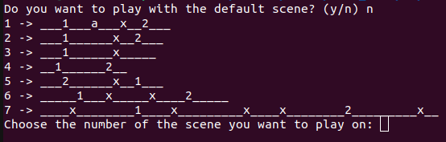
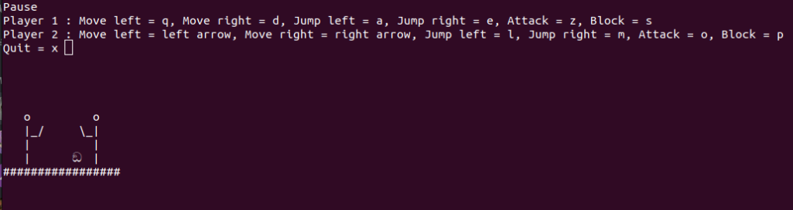

# Fancy_Fencing

## Table of Contents
- [Fancy\_Fencing](#fancy_fencing)
  - [Table of Contents](#table-of-contents)
  - [Installation and execution](#installation-and-execution)
  - [Game](#game)
  - [Thanks to](#thanks-to)
 

Fancy fencing is a fencing game made entirely in Python3. Two players fight to death to determine who's the best fencer in the world.

## Installation and execution
The game runs on Linux. I did not try it on MacOs or Windows so try it only on Linux please.
The library *curses* has to be installed:
```
$ pip install curses
```

Installing the game:
```
$ git clone https://github.com/Grillacier/Fancy_Fencing.git
$ cd Fancy_Fencing/
$ python3 main.py
```

## Game
First, we are asked if we want to play with the default scene or if we want to choose one.


Some of the scenes are not valid because I wanted to show I could handle this problem if it had to occur. We have to choose a scene where there is only one '1', one '2', some '_' and some 'x' (but a scene without any 'x' is also valid). The '1' has to be before the '2' and there cannot be any other character. Also, the file extension has to be ".ffscene"

Then, we are asked to choose the parameters for the game, meaning the number of fps and players' characteristics. There are a lot of them so playing with the default parameters is a good idea if you don't want think of a name for your characters.


We can finally play!


Player 1 moves by pressing 'q' and 'd' and player 2 by pressing the left and right keys. For the other keys, let's look at this screenshot because there are a lot of them and I'm too lazy to write them all. Pressing 'n' will open this pause menu:


By pressing 'x' in the pause menu, we can end the game.

A player scores a point when attacking the other one and the later is close enough and is not blocking. Everytime an attack lands, both players go back to their original position.

Finally, when one player gets 3 points (it's not a long game) this player wins.


I named my players Nathy and Ricky after my rabbits because they are the cutest in the world :rabbit:


## Thanks to
I would like to thank everyone who asked questions on Moodle so that when I did not understand something, the explanation was already there for me to read.

Have fun fencing!